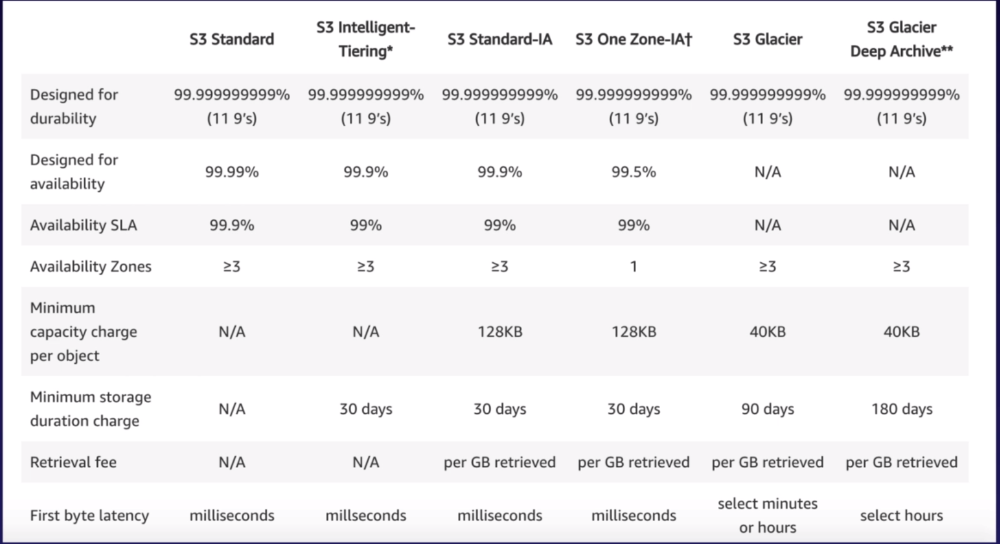

# CHAPTER 3 | S3 Object Storage and CDN

## S3

### [What's S3](https://aws.amazon.com/s3/)

* Object-based storage: you can save only object, you can't, for example, install an OS (In this case you need block-based storage).
* Files can save from 0 Bytes to 5 TB.
* No storage Limits.
* Files are stored in Buckets (a folder in a cloud).
* Each bucket is created in a specific region, and data does not leave the region unless explicitly copied by the user.
* S3 is a universal namespace, the name must be unique globally. So you **cannot** have the same name as someone else.
* Sample of an S3 URL: ```https://s3-eu-west-1.amazonaws.com/yourbucket```.
* When you upload an object in S3 you get an HTTP 200 OK code back along with MD5 checksum.
* Prefixes and delimiters can be used in key names to organize and navigate data hierarchically much like a traditional file system.

### Data Consistency for S3

* It's read-after-write consistency for new objects.
* It's eventually consistent for overwriting and deletes (this means it can take some time to propagate).
* S3 is automatically spread / replicated across multiple AZ's free of charge.

### Components

* S3 is an object. Objects consist of:
  * Key (name of the object): prefixes are part of the key as well. For example; some_prefix/and_another_prefix/file.txt.
  * Value (data)
  * Version ID (Used on versioning)
  * Metadata with a limit of up to 2KB (a set of data that describes and gives information about the object data.)
  * Tags up to 10 of them.
  * Subresources:
    * Access Control List (Decide who can access files)
    * Torrent (Not an exam topic)

### Basics

* S3 SLA: 99.9% availability
* S3 is built for 99.99%
* S3 guarantees 11x9s (99.999999999) durability for S3 information.
* Tiered Storage (classes) available
* You can have lifecycle management
* Versioning
* Supports [multi-part upload](https://docs.aws.amazon.com/AmazonS3/latest/dev/mpuoverview.html).
  * With a single PUT operation, you can upload objects up to 5 GB in size.
  * Using the multipart upload API, you can upload large objects, up to 5 TB.
  * It's suggested use multi-part upload for files over 100 MB to get better performance in terms of upload duration.
* Encryption
* Access control (permissions on single files) and bucket policies (permissions on buckets)



### [S3 Storage Tiers](https://aws.amazon.com/s3/storage-classes/)

* S3 Standard: 99.99% availability 11x9s durability. (it sustains the loss of 2 facilities concurrently)
* S3 IA: (Infrequently Accessed): For data that is accessed less frequently, but needs rapid access. You are charged a retrieval fee per GB retrieved.
* S3 One Zone IA: Like S3 IA but data is stored only in one AZ.
* Glacier: Most cheap, used for archival only.
  * Expedited: few minutes for retrieval
  * Standard: 3-5 hours for retrieval
  * Bulk: 5-12 hours for retrieval
  * It encrypts data by default
  * Regionally availability
  * Designed with 11x9s durability, like S3

### Scalability

* It provides increased performance to support at least 3,500 requests per second to add data and 5,500 requests per second to retrieve data, which can save significant processing time for no additional charge.
* Each S3 prefix can support these request rates, making it simple to increase performance significantly.
* This S3 request rate performance increase removes any previous guidance to randomize object prefixes to achieve faster performance. That means you can now use logical or sequential naming patterns in S3 object naming without any performance implications.

### [Charges](https://aws.amazon.com/s3/pricing/)

S3 is charged for:

* Storage
* Requests
* Storage management pricing
* Data Transfer Pricing
* Transfer acceleration (it's using CloudFront the AWS CDN) using edge locations

### [Server Side Encryption and ACL](https://docs.aws.amazon.com/AmazonS3/latest/dev/UsingServerSideEncryption.html)

Amazon S3 encrypts your data at the object level as it writes it to disks in its data centers and decrypts it for you when you access it. 256-bit Advanced Encryption Standard (AES) is used.

* SSE-S3 (AWS-Managed Keys): AWS handles the key management and key protection for S3.
* SSE-KMS (AWS-KMS Keys): Use the keys from AWS-KMS.
* SSE-C (Customer-Provided Keys): Customer provides its own encryption keys.

* Control access to the bucket using bucket ACL or Bucket policies.
* By default all buckets and objects within them are private.

### Client Side Encryption

* It refers to encrypting data on the client side of your application before sending it to S3.
* There are 2 options:
  * Use an AWS KMS-managed customer master key.
  * Use a client-side master key.

### [S3 Version Control](https://docs.aws.amazon.com/AmazonS3/latest/dev/Versioning.html)

* Once you enable versioning, you can't disable it, you can only suspend it. A way of disabling it is to delete the bucket and re-create it
* Every time you update an object, it will become private by default.
* It integrates with Lifecycle rules.
* You pay for each version you have.
* Delete an object:

    Once you delete a file inside a versioned bucket, you don't delete the file, you simply add a Delete Marker (this basically creates a new version of the object)
    If you delete the version with the Detele Marker you will basically restore the object.
    If you want to permanently delete the object, you have to delete all the Versions of the object.
    You can optionally add another layer of security by configuring a bucket to enable MFA Delete.

    More info about versioning:
    [ObjectVersioning](https://docs.aws.amazon.com/AmazonS3/latest/dev/ObjectVersioning.html)
    and
    [Versioning](https://docs.aws.amazon.com/AmazonS3/latest/dev/Versioning.html)

### [S3 Cross region replication](https://docs.aws.amazon.com/AmazonS3/latest/dev/crr.html)

* Regions must be unique.
* Need to enable versioning to enable cross region replication.
* Cross region replication doesn't replicate existing objects by default, only new ones (after the replication is configured) will be replicated automatically.
* In order to replicate the existing objects, you need to copy `cp` using the aws cli:

    `aws s3 cp --recursive s3://alessio-casco-versioning s3://alessio-casco-versioning-replica-sydney`
* If you delete an object in the primary bucket, the delete action and markers won't be done or replicated in your remote bucket, this is a security function.
* Only creations and modifications are replicated to the bucket in the other regions NOT the deletion.
* You can't replicate over multiple buckets, the maps are always 1-to-1.

## [CloudFront](https://aws.amazon.com/cloudfront/)

### [What's a CDN](https://www.cloudflare.com/learning/cdn/what-is-a-cdn/)

* A content delivery network or content distribution network is a geographically distributed network of proxy servers and their data centres.

* Key terminology about CloudFront:
  * Edge Location: Is the location where the content is cached (separate from AWS AZ's or regions)
    Be aware that you can also write on edge locations, they are not read only.
  * Invalidating (erasing) the cache costs money. Using less TTL to keep the content dynamic is a better option cost-wise.
  * Origin: Is the source of the files the CDN will distribute. An origin can be an EC2 instance, an S3 bucket, an Elastic Load Balancer or Route53, you can also have your own origin. It's not mandatory that it is within AWS.
  * Origin failover is supported for multiple origins to increase availability.
  * Distribution: Is the name AWS calls CDN's.
    * You can have two types: Web that is for generic web contents and RTMP that is for video streaming.
    * TTL: time to live of the cached object.
  * One can use signed urls or sgined cookies to share the contents for premium users.

### [S3 Security & Encryption](https://aws.amazon.com/blogs/aws/new-amazon-s3-encryption-security-features/)

* You can configure S3 to create access logs for requests made to the S3 bucket.
* Access control for buckets:
  * Bucket policies: Bucket wide permissions.
  * Access control list: Permissions that can be applied to the single object.

* Encryption:
  * In transit: from to your bucket, HTTPS for example.
  * At rest:
    * Server-side encryption:
      * S3 Managed Keys: SSE-S3 (Keys are managed by S3)
      * Key Management Service: SS3-KMS the customer manages the keys
      * Server-side encryption: Here you manage the keys, and Amazon manage the writes
  * Client-side Encryption: You encrypt the data and you upload it encrypted to S3

## [Amazon Storage](https://aws.amazon.com/products/storage/)

### [Amazon Storage Gateway](https://aws.amazon.com/storagegateway/)

What's an Amazon Storage Gateway: AWS Storage Gateway connects an on-premises software appliance with cloud-based storage to provide seamless integration with data security features between your on-premises IT environment and the AWS storage infrastructure.

* File Gateway: For flat files, stored directly in S3. You can mount NFS points.
* Volume gateway (iSCSI): Block-based storage
  * Store volume (you keep all your data on prem)
  * Cached Volumes (you keep only the most recent data on prem)
* Tape Gateway (VTL): Virtual tapes

### [Snowball](https://aws.amazon.com/snowball/)

Import Export is still available and was the first version of snowball, you used to ship your drives to AWS.

Snowball is (an appliance) a petabyte-scale data transport solution that uses devices designed to be secure to transfer large amounts of data into and out of the AWS Cloud. One device supports 80 TB data.

Snowball edge: is a 100TB data transfer device with onboard storage-computer capabilities. It's like an AWS DC in a box.

Snowmobile: AWS Snowmobile is an Exabyte-scale data transfer service used to move extremely large amounts of data to AWS. A truck full of disks basically.

## [S3 Transfer Acceleration](https://docs.aws.amazon.com/AmazonS3/latest/dev/transfer-acceleration.html)

Instead of uploading files directly to your S3 bucket, you can use the AWS edge network.
Using a specific URL, you upload the file to your local edge and then the file will be uploaded to S3
an example or URL:  alessio-casco-accelerate.s3-accelerate.amazonaws.com

## [Static Website Using S3](https://docs.aws.amazon.com/AmazonS3/latest/dev/HowDoIWebsiteConfiguration.html)

* You can use bucket policies to make entire S3 buckets public.
* You can use S3 to host only static websites.
* CORS can be enabled.
* S3 Scales automatically to meet demand.

[Permissions Required for Website Access](https://docs.aws.amazon.com/AmazonS3/latest/dev/WebsiteAccessPermissionsReqd.html)

On console: Amazon S3 => Your_Bucket => Permissions => Bucket Policy

```json
{
  "Version":"2012-10-17",
  "Statement":[
    {
      "Sid":"PublicReadGetObject",
      "Effect":"Allow",
      "Principal": "*",
      "Action":["s3:GetObject"],
      "Resource":["arn:aws:s3:::example-bucket/*"]
    }
  ]
}
```

_[!!! Read the S3 FAQs before the exam !!!](https://aws.amazon.com/s3/faqs/)_